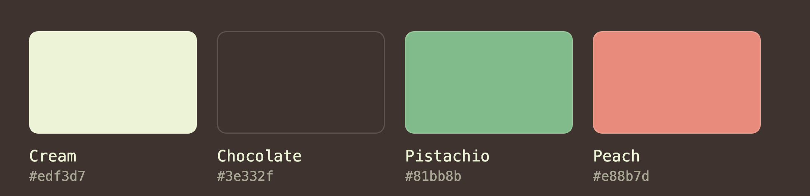
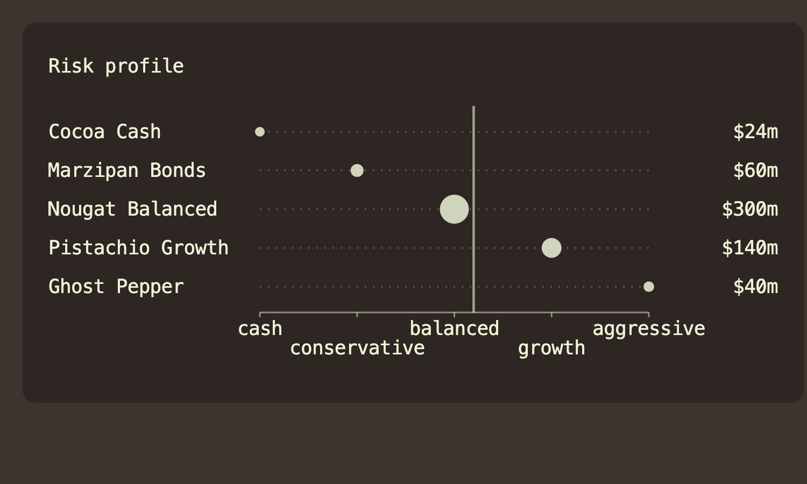
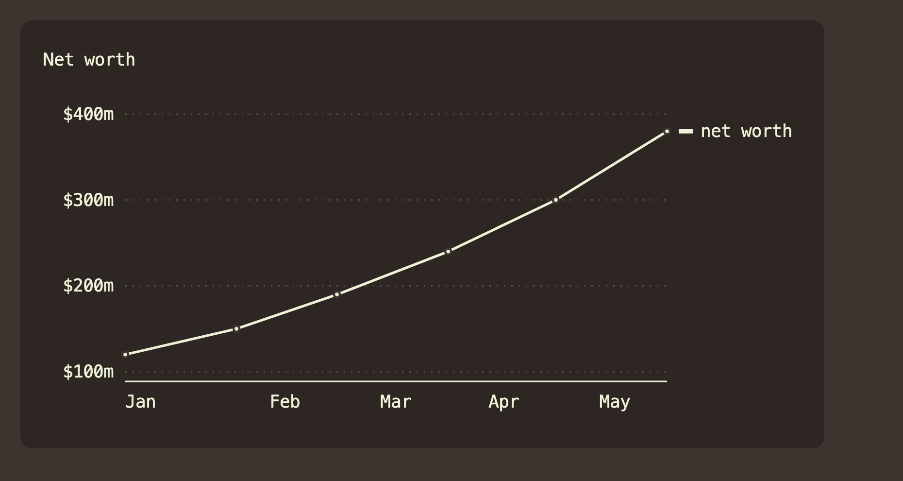
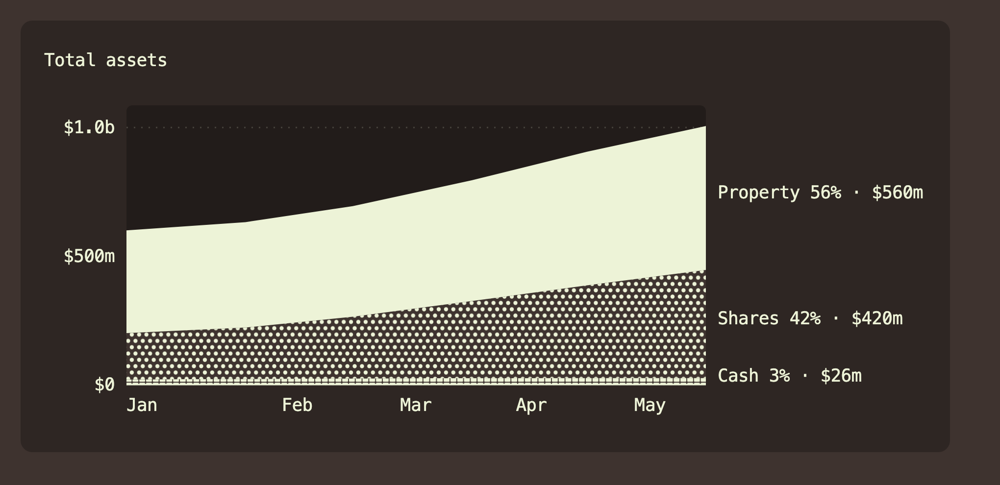
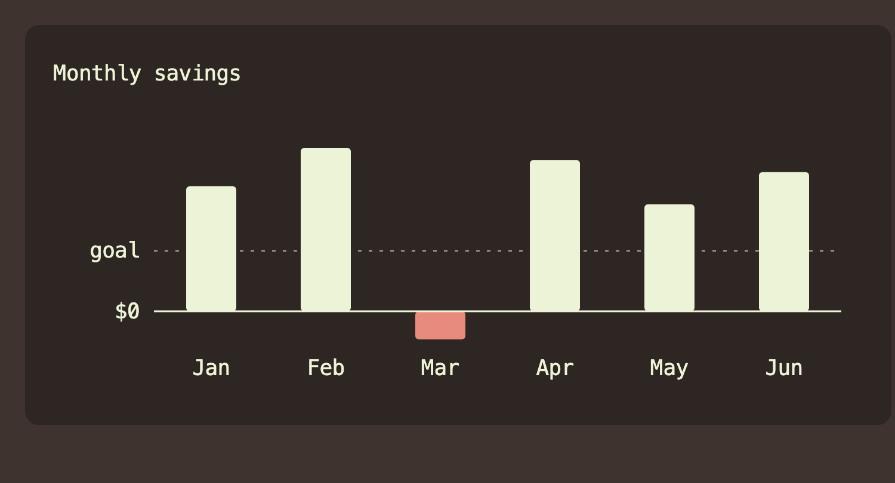
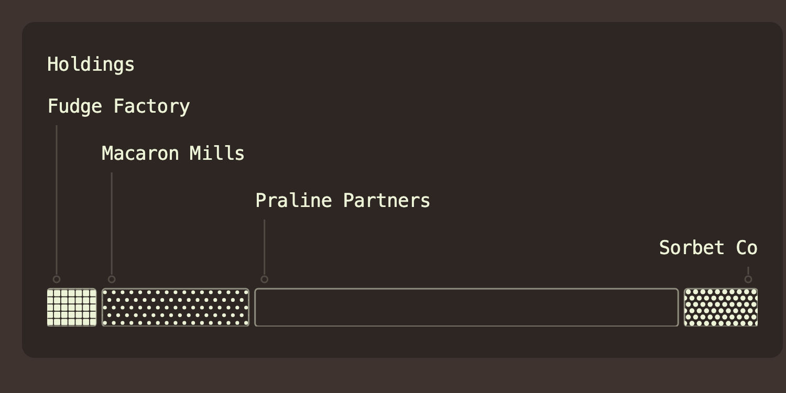
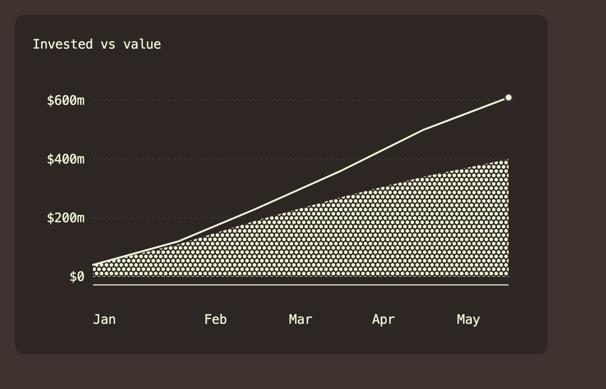

# Sediment

Small, dependency-free SVG charts. One file, no framework, no build step, no
runtime dependencies. It adds a single global, `Sediment`.

The style is Tufte-ish: range-frame axes, a dotted hairline grid, labels sitting
right on the data. Series tell themselves apart by texture (dot and line
patterns), not colour, so a chart stays readable with no colour at all.

## Suggested palette

Sediment ships no colours of its own. You pass every colour in, so it fits any
theme. If you want a starting point, this is the warm, high-contrast set the
charts below were drawn with.



| Colour | Hex | Role |
| --- | --- | --- |
| Cream | `#edf3d7` | ink, marks, lines |
| Chocolate | `#3e332f` | background |
| Pistachio | `#81bb8b` | gain |
| Peach | `#e88b7d` | loss |

Hairlines and grid lines are Cream at 50% opacity, a tint rather than a separate
colour.

## The charts

### dotPlot
Items on a shared ordinal axis. Position carries the meaning, dot area carries
the amount, and a solid line marks the average.



```js
Sediment.dotPlot({
  host, levels: ["cash", "conservative", "balanced", "growth", "aggressive"],
  rows: funds.map(f => ({ pos: f.band, value: f.value, label: f.name, valueLabel: nzd(f.value) })),
  avgPos: weightedAverage, dotColor: cream, tokens: { hair: border, fg: cream },
});
```

### lineChart
Lines over a time series, range-framed, with the value labelled at the end.



```js
Sediment.lineChart({
  host, xs, series: [{ values: netWorth, color: cream }],
  tokens: { axis: cream, hair, page: bg }, fmtK, xLabel, endLabel: () => "net worth",
});
```

### stackedArea
Stacked bands over time, each band a texture, totals labelled on the right.



```js
Sediment.stackedArea({
  host, xs, n: 4, ink: cream, bg,
  bands: [{ values: cash, ti: 0, label: "Cash" }, { values: shares, ti: 1, label: "Shares" }, ...],
  tokens: { surface, axis: cream, hair }, fmtK, xLabel,
});
```

### columnChart
Columns on a shared baseline, positive and negative, with an optional target line.



```js
Sediment.columnChart({
  host, bars: months.map(m => ({ value: m.net, label: m.name })),
  posColor: gain, negColor: loss, ink: cream, tokens: { border },
  target: 3000, targetLabel: "goal",
});
```

### segmentedBar
Proportional segments, texture-coded, with optional stepped connector labels.



```js
Sediment.segmentedBar({
  host, n: 5, total, ink: cream, connectors: true,
  segments: holdings.map((h, i) => ({ label: h.name, value: h.value, ti: i })),
  tokens: { border, hair },
});
```

### barLineChart
A textured area for one measure with a line over it for another, so the gap
between them reads at a glance.



```js
Sediment.barLineChart({
  host, xs, bars: invested, line: value, ti: 1, ink: cream,
  tokens: { axis: cream, hair, page: bg }, fmtK, xLabel,
});
```

## Install

Copy the two files into your project and load them:

```html
<link rel="stylesheet" href="sediment.css">
<script src="sediment.js"></script>
```

`sediment.js` adds `window.Sediment`. `sediment.css` carries the companion
styles. Only the `svg text` rule is strictly required; without it labels render
black at the wrong size. Text colour is inherited, so set `color` on the chart
host and every label follows.

To track this repo and pull updates, add it as a git submodule and point your
build at `sediment.js`:

```bash
git submodule add https://github.com/jtrotsky/sediment.git vendor/sediment
# later, to update:
git submodule update --remote vendor/sediment
```

`demo.html` renders all of the above from live code if you want to open it and
poke at it.

## How it works

Every builder takes resolved values. Colours are CSS colour strings, data is
plain numbers, and text comes from formatter callbacks. The module never reads
your theme, your DOM beyond the host you give it, or any global state. You write
a thin adapter that resolves your theme (for example with `getComputedStyle`)
and feeds these builders. That is what keeps it liftable into any project.

## Builder reference

Each builder takes one `cfg` object. `host` is the element the SVG mounts into,
sized to the host's width. `tip` is an optional tooltip handle from
`Sediment.tip(el)`.

**dotPlot**
```
host, rowH=22, padT=8, axisPad=30, rightPad=88,
rows:[{ pos, value, label, valueLabel, tipHTML }],   // pos = 0..(levels-1)
levels:[str],                                        // axis ticks, left to right
avgPos,                                              // optional average line position
staggerLabels,                                       // two-row axis when labels would collide
dotColor, tokens:{ hair, fg }, tip
```

**lineChart**
```
host, H=230, padL=56, padR=92, padT=14, padB=26,
xs:[t], series:[{ values:[v], color }],
tokens:{ axis, hair, page },
fmtK, xLabel, endLabel, annotateExtremes, tip, tipHTML
```

**stackedArea**
```
host, H=230, padL=56, padR=110, padT=14, padB=26,
xs:[t], bands:[{ values:[v], ti, label }], n,        // ti = texture index
ink, bg, tokens:{ surface, axis, hair },
fmtK, xLabel, tip, tipHTML
```

**columnChart**
```
host, H=160, padL=56, padR=12, padT=14, padB=26,
bars:[{ value, label, faint }],
posColor, negColor, ink, tokens:{ border },
target, targetLabel, zeroLabel="$0", tip, tipHTML
```

**segmentedBar**
```
host, barH=24, gap=4, minSeg=24,
segments:[{ label, value, ti, tipHTML }], n, total,
ink, tokens:{ border, hair },
connectors=false, step=30, topPad=14, labelGap=8, tip
```

**barLineChart**
```
host, H=230, padL=56, padR=20, padT=14, padB=26,
xs:[t], bars:[v], line:[v], ti, ink,
tokens:{ axis, hair, page }, fmtK, xLabel, tip, tipHTML
```

## Helpers

- `Sediment.tip(el)` returns `{ show(host, x, y, html), hide }`, a floating
  tooltip bound to `el`. Style it with the `.sediment-tip` rules in
  `sediment.css`.
- `Sediment.texture(svg, i, n, ink)` is the pattern fill for band `i` of `n`
  (the last band is solid). `Sediment.chip(i, n, ink, size)` returns an
  inline-SVG swatch of that texture for legends and tables.
- `Sediment.svgEl`, `frame`, `yScale`, `niceTicks`, `grid`, `monthTicks`,
  `placedMonthTicks` are the low-level building blocks.

## Licence

MIT. See [LICENSE](LICENSE).
